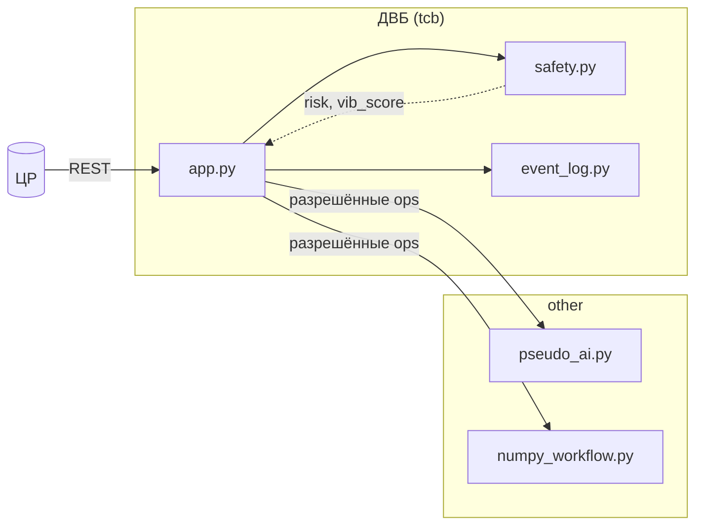

# Решение АБУ (конкурс)

**Участник / команда:** _указать_  
**Коммит / тег:** _указать_  
**Дата:** 2026-05-17

Полная копия отчёта для жюри (критерий C17): [`docs/solution.md`](../docs/solution.md).  
Таблица баллов: [`docs/evaluation_report.md`](../docs/evaluation_report.md).

---

## 1. Архитектура решения

Код в каталоге `src_solution/`. АБУ разделён на **доверенную вычислительную базу (ДВБ)** и **недоверенную зону** (`other`), см. [architecture.md](../docs/architecture.md) и [sbom_guide.md](../docs/sbom_guide.md).

| Зона | Каталог | Модули |
|------|---------|--------|
| **ДВБ** | `abu/tcb/` | `app.py`, `safety.py`, `event_log.py`, `ipc_policies.json` |
| **Недоверенная** | `abu/other/` | `pseudo_ai.py`, `numpy_workflow.py` |

**Граница доверия:** `safety.py` не импортирует `pseudo_ai`; остановка — по `risk` и `vibration_score` из `app.py`. Вызовы в `other` — по `abu/tcb/ipc_policies.json`.

**Зависимости:** `requirements.txt`, `requirements-other.txt`.  
**SBOM:** `sbom/SBOM_TCB.cdx.json` (ДВБ), `sbom/SBOM_OTHER.cdx.json` (numpy, веб-стек).



**Отличие от** `src_starting_point/`: псевдо-ИИ и numpy в `other`; проверки безопасности в ДВБ; numpy только в **SBOM_OTHER**.

Диаграммы: [context.png](../docs/diagrams/png/context.png), [certification_pipeline.png](../docs/diagrams/png/certification_pipeline.png).

---

## 2. Политики безопасности и цели (ЦПБ)

Сопоставление SG и тестов: [security_tests.md](../docs/security_tests.md).

| SG | Реализация | Тесты |
|----|------------|-------|
| **SG_ADS_Authorized_critical_commands** | `safety.py`, `POST /api/v1/missions` | `tests/security/test_sg_authorized_commands.py`, `../tests/test_src_solution_tcb_coverage.py` |
| **SG_ADS_Controlled_operations** | `should_emergency_stop`, эвристики в `other` | `tests/security/test_sg_controlled_ops.py`, `tests/test_safety.py` |
| **SG_ADS_Security_events_store** | `EventLog`, API `/api/v1/events/*` | `tests/security/test_sg_security_events.py`, `tests/test_event_log.py` |

**IPC:** `abu/tcb/ipc_policies.json`.

---

## 3. Тесты

Из корня репозитория:

```bash
make install
make tests-all
```

```bash
pipenv run pytest -q src_starting_point/tests src_solution/tests tests
```

Покрытие ДВБ (C16):

```bash
pipenv run pytest -q src_starting_point/tests tests \
  --cov=src_solution.abu.tcb --cov-report=term-missing
```

Сквозной сценарий ЦР–АБУ: `tests/test_e2e_abu_dm_scenario.py`.

---

## 4. Тесты безопасности

```bash
pipenv run pytest -q -m security src_starting_point/tests/security src_solution/tests/security
```

---

## 5. Сертификация

```bash
bash scripts/prepare_certification_bundle_solution.sh
make certify-abu
```

В пакете: `abu/`, `requirements.txt`, тесты, `sbom/SBOM_*.cdx.json`, `security/sga.json`.

---

## 6. Диаграммы

| Диаграмма | Файл |
|-----------|------|
| Контекст | [context.png](../docs/diagrams/png/context.png) |
| АБУ v1 | [abu_v1_internal.png](../docs/diagrams/png/abu_v1_internal.png) |
| Миссия | [sequence_mission.png](../docs/diagrams/png/sequence_mission.png) |
| Сертификация | [certification_pipeline.png](../docs/diagrams/png/certification_pipeline.png) |

---

## Быстрые команды

| Действие | Команда |
|----------|---------|
| Тесты | `make tests-all` |
| Баллы | `make evaluate-score` |
| Пакет на сертификацию | `bash scripts/prepare_certification_bundle_solution.sh` |
| Сертификация | `make certify-abu` |

**Окружение:** Python 3.12+, Pipenv; рекомендуется Linux / WSL2 — см. [README.md](../README.md).
