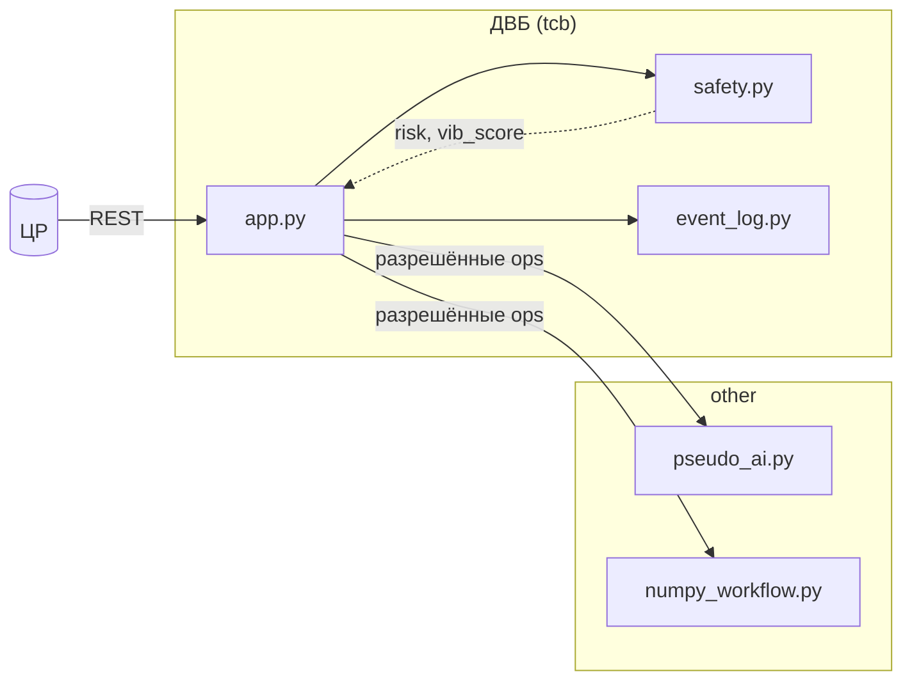

# Отчёт о конкурсном решении

**Участник / команда:** _указать_  
**Коммит / тег:** _указать_  
**Дата:** 2026-05-17

---

## 1. Архитектура решения

Решение размещено в `src_solution/`. Код АБУ разделён на **доверенную вычислительную базу (ДВБ)** и **недоверенную зону** (`other`), согласованно с [architecture.md](architecture.md) и [sbom_guide.md](sbom_guide.md).

| Зона | Каталог | Модули |
|------|---------|--------|
| **ДВБ** | `src_solution/abu/tcb/` | `app.py` — HTTP API и оркестрация миссии; `safety.py` — лимиты и аварийный стоп; `event_log.py` — журнал событий; `ipc_policies.json` — разрешённые вызовы в `other` |
| **Недоверенная** | `src_solution/abu/other/` | `pseudo_ai.py` — эвристики риска и режима; `numpy_workflow.py` — сглаживание вибрации на numpy |

**Граница доверия:** модуль `safety.py` не импортирует `pseudo_ai`; решения остановки принимаются по уже вычисленным `risk` и `vibration_score`, переданным из `app.py`. Прямые вызовы из ДВБ в `other` ограничены декларацией в `ipc_policies.json` (операции `anomaly_vibration`, `regime_suggest`, `risk_flag`, `smooth_vibration_window`).

**Зависимости:** зафиксированы в `src_solution/requirements.txt` и `requirements-other.txt`; SBOM — `src_solution/sbom/SBOM_TCB.cdx.json` (только `abu-controller`) и `SBOM_OTHER.cdx.json` (numpy, веб-стек, `abu-pseudo-ai`).



**Отличие от заготовки** `src_starting_point/`: псевдо-ИИ и numpy вынесены в `other`; проверки `enforce_depth_cap`, `enforce_rpm_cap`, `should_emergency_stop` — в ДВБ; numpy декларирован только в **SBOM_OTHER**.

Диаграммы контекста и сертификации (организаторы): [diagrams/png/context.png](diagrams/png/context.png), [diagrams/png/certification_pipeline.png](diagrams/png/certification_pipeline.png).

---

## 2. Политики безопасности и цели (ЦПБ)

Цели безопасности (SG) из SGA сопоставлены с тестами в [security_tests.md](security_tests.md).

| SG | Реализация в решении | Тесты |
|----|----------------------|-------|
| **SG_ADS_Authorized_critical_commands** | Лимиты в `safety.py`; миссия только через `POST /api/v1/missions` | `src_solution/tests/security/test_sg_authorized_commands.py`, `tests/test_src_solution_tcb_coverage.py` |
| **SG_ADS_Controlled_operations** | `should_emergency_stop` по `risk` и порогу вибрации; делегирование эвристик в `other` | `src_solution/tests/security/test_sg_controlled_ops.py`, `src_solution/tests/test_safety.py` |
| **SG_ADS_Security_events_store** | `EventLog`: кольцо + полный файл; API `/api/v1/events/*` | `src_solution/tests/security/test_sg_security_events.py`, `src_solution/tests/test_event_log.py`, `tests/test_src_solution_tcb_coverage.py` |

**IPC-политика:** `src_solution/abu/tcb/ipc_policies.json` — белый список вызовов `tcb.app` → `other.*`. Расширение недоверенной зоны требует обновления политики и SBOM_OTHER.

**Ограничение прототипа:** полноценный `security_monitor` с изоляцией процессов не реализован; контроль — на уровне модулей, тестов и декларации IPC (см. [criteria_rubric.md](criteria_rubric.md) C18–C19).

---

## 3. Результаты сквозных тестов

**Команды:**

```bash
make install
make tests-all
```

`make tests-all` выполняет:

```bash
pipenv run pytest -q src_starting_point/tests src_solution/tests tests
```

**Сквозной сценарий ЦР–АБУ:** `tests/test_e2e_abu_dm_scenario.py` (маршрутизация миссии через ASGI-транспорт к приложению заготовки; сценарий организаторов).

**Тесты решения в корневом `tests/`** (импорт `src_solution`, покрытие ДВБ для оценки):

```bash
pipenv run pytest -q src_starting_point/tests tests \
  --cov=src_solution.abu.tcb --cov-report=term-missing
```

Файлы: `tests/test_src_solution_app.py`, `tests/test_src_solution_tcb.py`, `tests/test_src_solution_tcb_coverage.py`.

**Ожидаемый результат:** все тесты завершаются с кодом 0; покрытие `src_solution.abu.tcb` — не ниже 80% (критерий C16).

---

## 4. Результаты тестов безопасности

**Прогон:**

```bash
pipenv run pytest -q -m security src_starting_point/tests/security src_solution/tests/security
```

| Файл | Маркер | SG |
|------|--------|-----|
| `src_solution/tests/security/test_sg_authorized_commands.py` | `security` | Authorized commands |
| `src_solution/tests/security/test_sg_controlled_ops.py` | `security` | Controlled operations |
| `src_solution/tests/security/test_sg_security_events.py` | `security` | Security events store |
| `src_solution/tests/security/test_app_mission_flow.py` | `security` | Интеграция миссии |

Дополнительно: модульные тесты ДВБ в `src_solution/tests/test_safety.py` и `tests/test_src_solution_tcb_coverage.py`.

**Покрытие по ЦБ в песочнице Регулятора:** поле `security_coverage_percent` в ответе API / логе `make certify-abu` (порог по умолчанию 70%, переменная `REGULATOR_SECURITY_COV_FAIL_UNDER`).

---

## 5. Сертификация

**Подготовка пакета решения:**

```bash
bash scripts/prepare_certification_bundle_solution.sh
make certify-abu
```

В архив входят: исходники `src_solution/abu`, `requirements.txt`, тесты, `sbom/SBOM_TCB.cdx.json`, `sbom/SBOM_OTHER.cdx.json`, `security/sga.json` (из примера организаторов).

**Ожидаемый фрагмент лога (после успешного прогона):**

```
Результат сертификации: успешно
Стоимость (усл. ед.): <estimated_cost>
Сертификат (SHA-256 пакета): <certificate_id — 64 hex>
security_coverage_percent: <значение ≥ 70>
tcb_lines_of_code: <LOC ДВБ>
tcb_cyclomatic_sum: <суммарная цикломатическая сложность>
```

**Стоимость:** полиномиальная модель по метрикам SBOM_TCB; SBOM_OTHER учитывается с делителем 100; при numpy в SBOM_TCB — множитель ×2 (в решении numpy только в SBOM_OTHER).

---

## 6. Архитектурные диаграммы

| Диаграмма | Файл |
|-----------|------|
| Контекст ЦР / АБУ / Регулятор | [diagrams/png/context.png](diagrams/png/context.png) |
| Внутреннее устройство АБУ (эталон v1) | [diagrams/png/abu_v1_internal.png](diagrams/png/abu_v1_internal.png) |
| Последовательность миссии | [diagrams/png/sequence_mission.png](diagrams/png/sequence_mission.png) |
| Пайплайн сертификации | [diagrams/png/certification_pipeline.png](diagrams/png/certification_pipeline.png) |
| TARA (обзор) | [diagrams/tara_iso21434_overview.puml](diagrams/tara_iso21434_overview.puml) |

Локальная схема разделения ДВБ / other — раздел 1 (mermaid).

---

## Примечания

- **Воспроизводимость:** Python 3.12+, `Pipfile.lock`; рекомендуется Linux / WSL2 / Codespaces ([README.md](../README.md)).
- **Оценка баллов:** `make evaluate-score`; таблица — [evaluation_report.md](evaluation_report.md).  
- **README решения:** [../src_solution/README.md](../src_solution/README.md).
- **Известные ограничения:** одна активная миссия в процессе; монитор доменов (C19) — задел через `ipc_policies.json`, без отдельного процесса-надсмотрщика.
